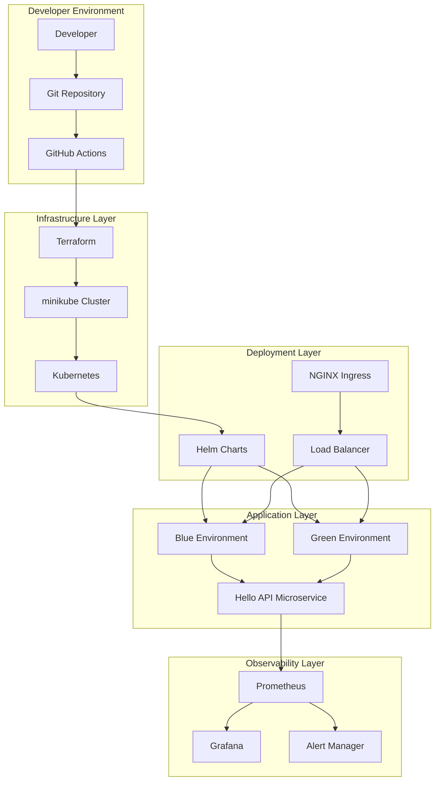
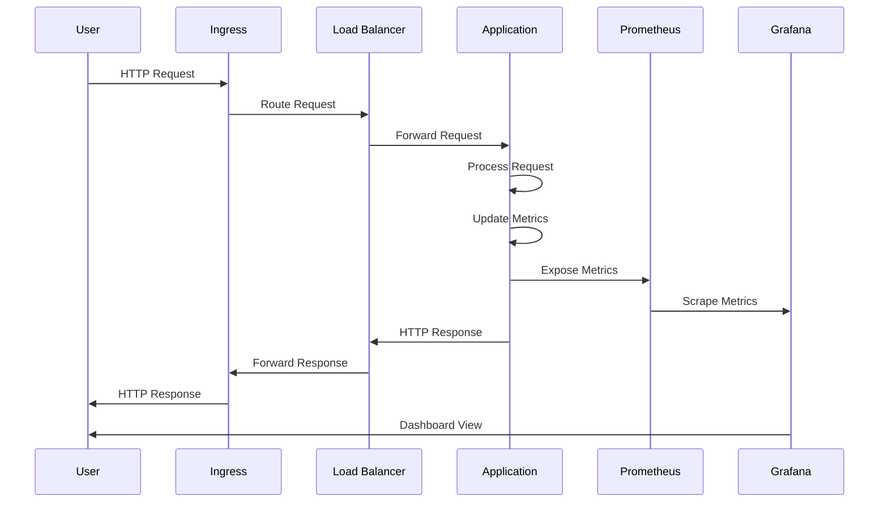
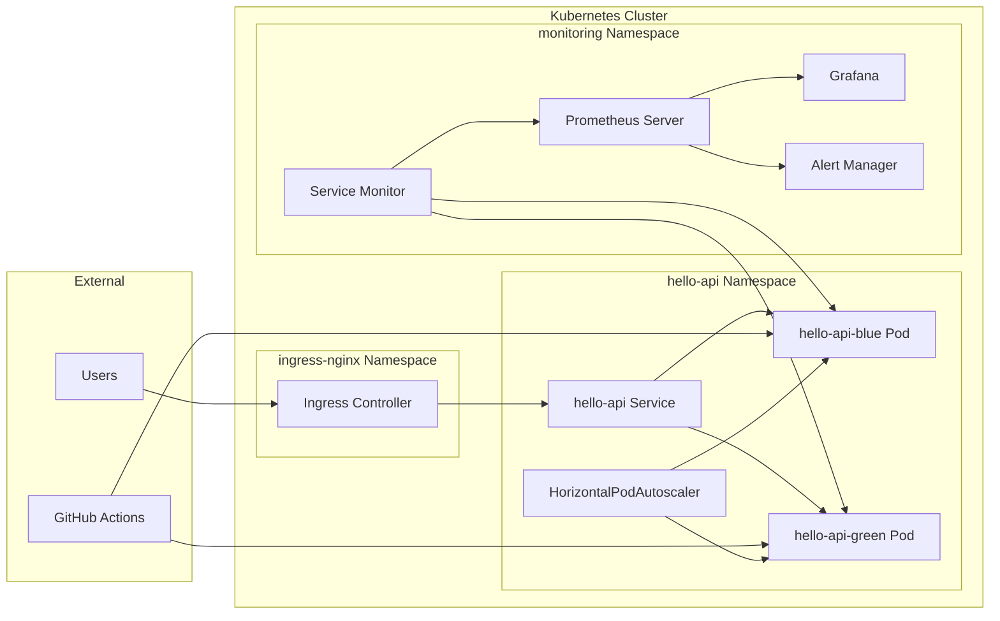
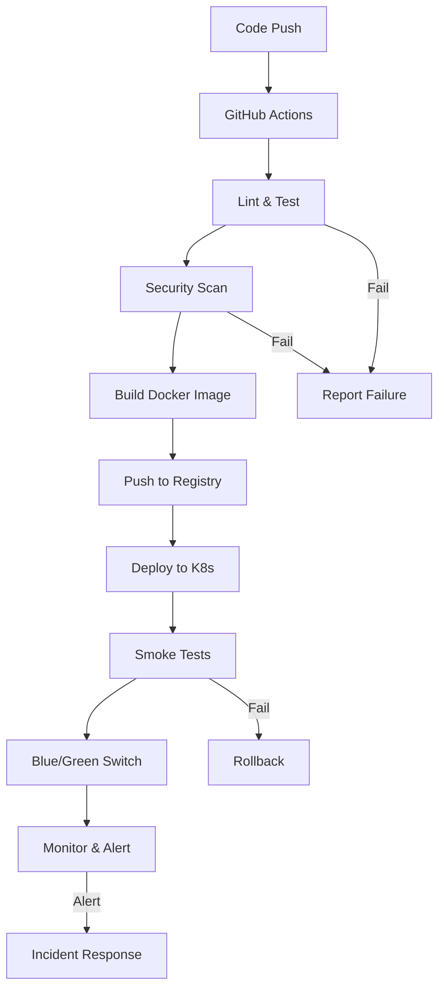
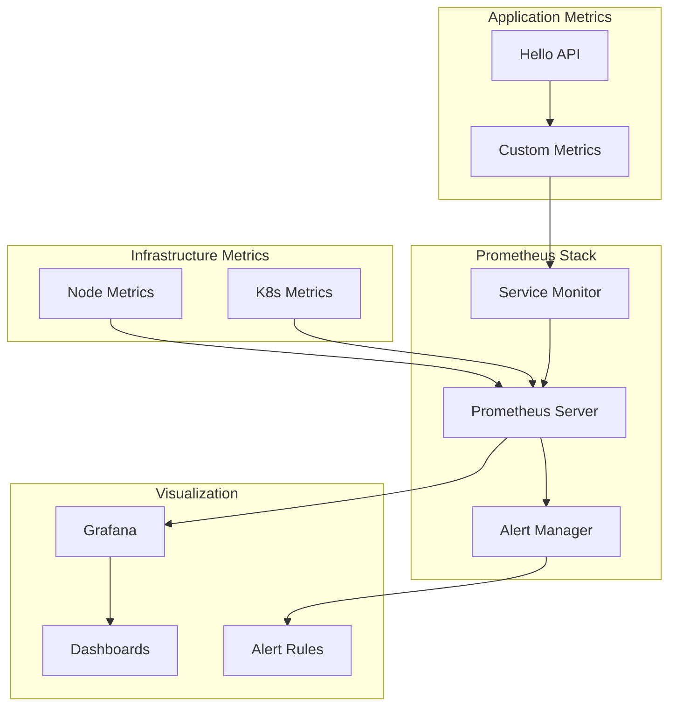
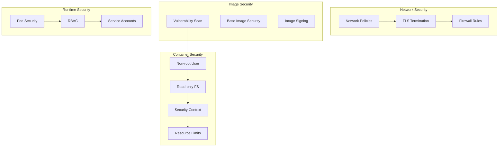
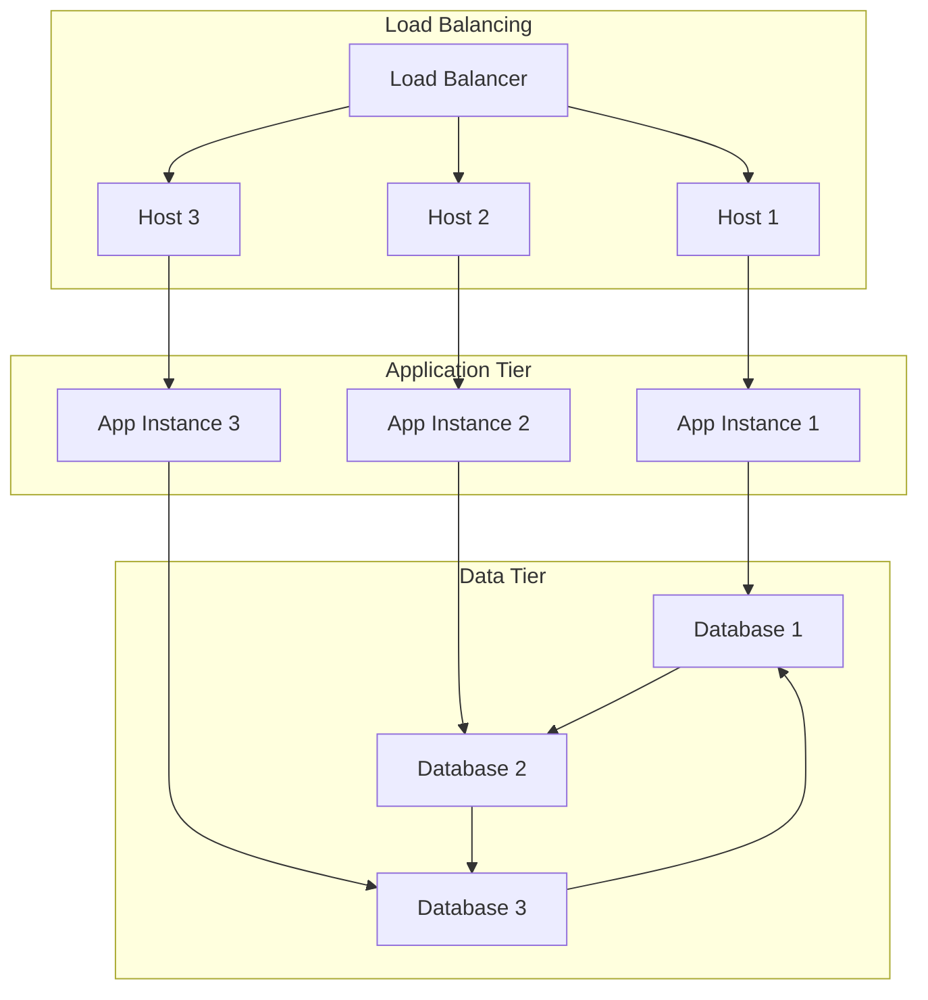
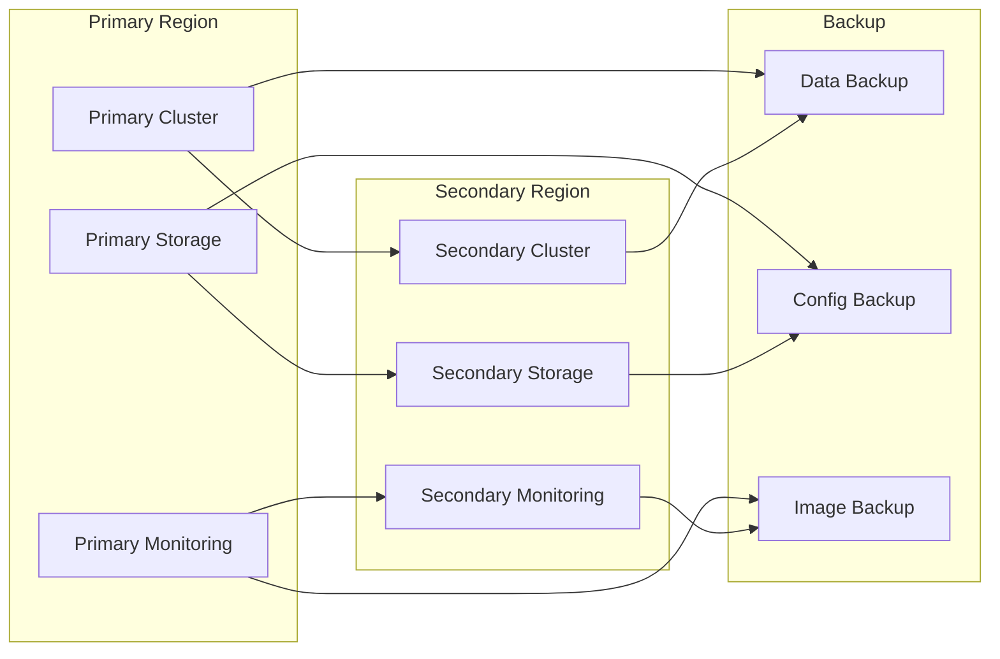

# Architecture Diagram

## System Overview

## Data Flow Diagram

## Component Architecture

## Deployment Pipeline

## Monitoring Stack

## Security Architecture

## High Availability Design

## Disaster Recovery

## Key Design Principles

### 1. **Separation of Concerns**
- Clear separation between infrastructure, application, and monitoring layers
- Modular design with well-defined interfaces

### 2. **High Availability**
- Multi-replica deployments
- Auto-scaling and auto-healing
- Load balancing and failover

### 3. **Observability**
- Comprehensive metrics collection
- Centralized logging and monitoring
- Proactive alerting and incident response

### 4. **Security**
- Defense in depth
- Least privilege access
- Regular security scanning and updates

### 5. **Automation**
- Infrastructure as Code
- Automated testing and deployment
- Self-healing and self-scaling systems

### 6. **Reliability**
- Blue/green deployments
- Circuit breakers and retries
- Graceful degradation

This architecture demonstrates enterprise-grade SRE practices while remaining simple enough to understand and demonstrate in an interview setting.
